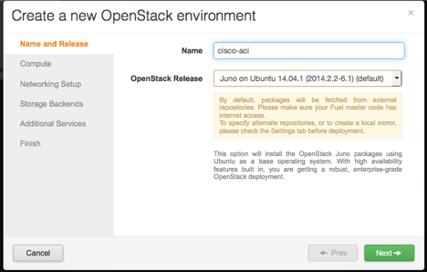
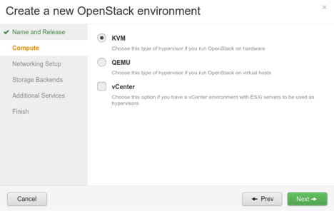
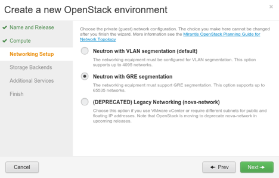
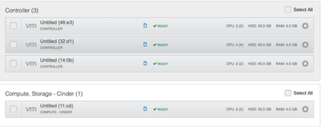
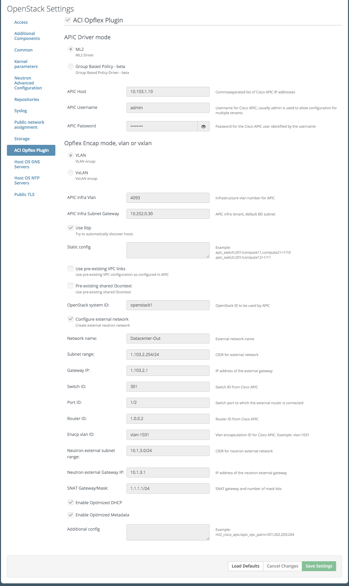

************************************************************
Guide to the Cisco ACI Opflex Plugin version 1.0.1 for Fuel
************************************************************

This document provides instructions for installing, configuring and using
Cisco ACI opflex plugin for Fuel.

Key terms, acronyms and abbreviations
=====================================

Cisco ACI/GBP
    The Cisco® Application Policy Infrastructure Controller (APIC) was designed based on open APIs, allowing it to be tightly integrated with cloud orchestration platforms such as OpenStack.
SDN
    Software defined network
RESTful API
    Representational state transfer
BGP
    Border gateway protocol
MOS
    Mirantis OpenStack

    
<Cisco ACI Opflex>
===================

Cisco ACI/GBP plugin for Fuel provides the functionality to add Cisco ACI/GB for Mirantis OpenStack as networking backend option using Fuel Web UI in a user-friendly manner.

License
-------

===================================   ==================
Component                              License type
===================================   ==================
Cisco ACI/GBP                          Commercial
Cisco ACI opflex plugin                Apache 2.0
========================================================

Requirements
------------

===================================   ==================
Requirement                           Version/Comment
===================================   ==================
Fuel                                    6.1
Cisco                                    1.1(4e)
.
========================================================

Limitations
-----------

During deploy its impossible to add default network to Cisco ACI so defaults network deployed by MOS called net04 and net04_ext and virtual router router04 is need to be removed after deployment and create one more time. Those networks and router are needed to run health check after deployment.

Installation Guide
==================

Cisco ACI Opflex installation
----------------------------------------

#. Download Cisco ACI/GBP plugin from the Fuel Plugins Catalog.
#. Copy the rpm downloaded at previous step to the Fuel Master node and install the plugin:

scp cisco-aci.1.0.1.noarch.rpm  <Fuel Master node ip>:/tmp/

#. Log into the Fuel Master node and install the plugin:

ssh <the Fuel Master node ip> 
fuel plugins --install /tmp/cisco-aci-1.0.1.noarch.rpm

You should get the following output:
Plugin <plugin-name-version>.rpm was successfully installed

#. Copy  install package (obtained from Cisco by subscription, see Prerequisites above) to the Fuel Master node and run the installation script to unpack the vendor package and populate plugin repository:

scp \*.deb <Fuel Master node ip>:/var/www/nailgun/plugins/cisco-aci-1.0.1/repositories/ubuntu/

Cisco ACI Opflex Configuration
----------------------------------------
#. Create a new OpenStack environment with Fuel UI wizard:

#. Please select KVM or QEMU hypervisor type for your environment

#. Please select Neutron network topology

#. Add nodes and assign them the following roles:
At least 1 Controller
At least 1 Compute

#. Open Settings tab of the Fuel Web UI and scroll the page down. Select the plugin checkbox:

#. Fill the plugin configuration fields with correct values:

Select the APIC Driver mode.
SET APIC Host, Username and password (if those data will be incorrect deploy will fail)
Set encapsulation mode, Infra vlan, Gateway and context name.

#.  Configure the rest of network settings. See details at Mirantis OpenStack User Guide.

The rest network configuration is up to you. See Mirantis OpenStack User Guide for instructions to configure other networking options. 

And finally, click Deploy changes to deploy the environment.

Appendix
========

Provide any links to external resources or documentation here.
#. Link 1
#. Link 2

